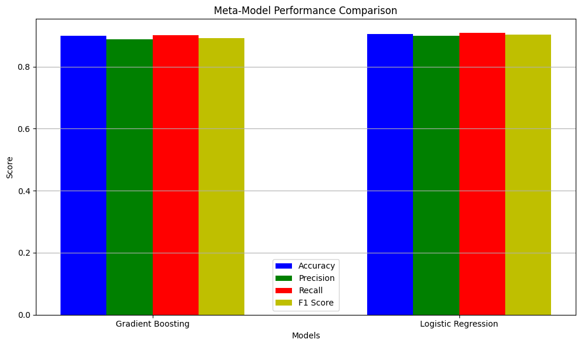
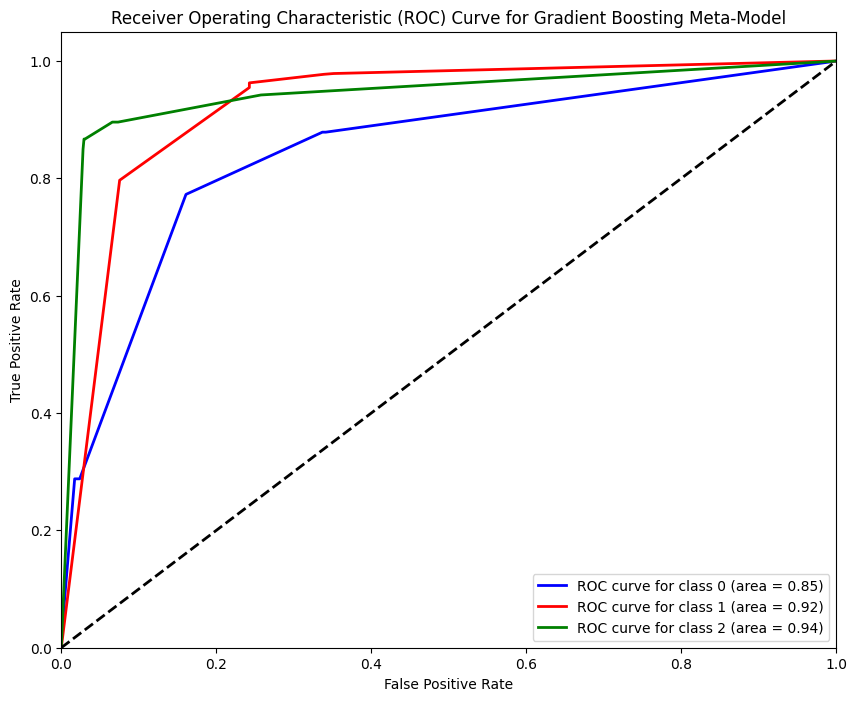
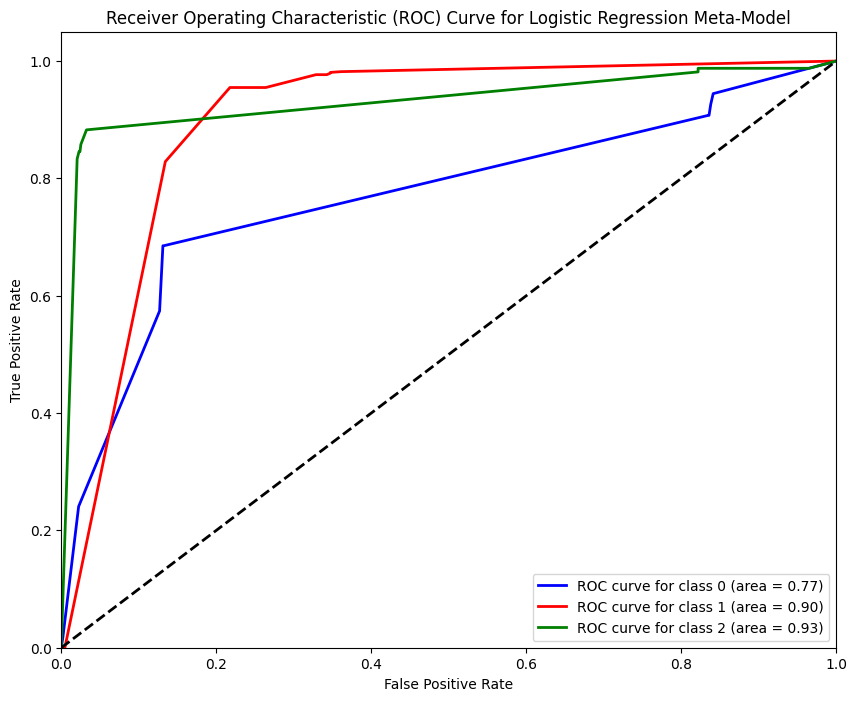

# Hate Speech Detection with Bias Mitigation and Ensemble Models

## Project Overview
This project aims to enhance the accuracy and fairness of hate speech detection by integrating **bias mitigation techniques** and **ensemble modeling** using **BERT**, **LSTM**, and **CNN** architectures. The **Hate Speech and Offensive Language dataset** was used, containing 24,783 manually labeled tweets. The tweets are categorized into **hate speech**, **offensive language**, and **neutral content**.

Our approach involves fine-tuning a BERT-based model with class weighting to mitigate bias and employing ensemble methods by combining **BERT**, **LSTM**, and **CNN** models to improve classification robustness and performance. The ensemble modeling uses **majority voting** and meta-modeling with **Gradient Boosting** and **Logistic Regression** to enhance the final predictions.

## Motivation
The hate speech and harmful content on social media platforms has necessitated effective and automated detection systems. However, existing models often suffer from biases, leading to unfair classifications and reduced accuracy for minority classes. This project focuses on developing a more accurate and fair hate speech detection system by leveraging advanced **ensemble learning techniques** and **bias mitigation strategies**.

## Dataset
We used the **Hate Speech and Offensive Language Dataset** ([link to dataset](https://github.com/t-davidson/hate-speech-and-offensive-language/tree/master/data)), which contains 24,783 tweets labeled into the following categories:
- **Hate Speech** (class 2)
- **Offensive Language** (class 1)
- **Neutral Content** (class 0)

## Technical Approach
Our project consists of the following main steps:
1. **Data Preprocessing**: 
    - **Text Normalization**: Convert text to lowercase and remove special characters.
    - **Tokenization**: Use BERT tokenizer to convert text into tokens.
    - **Padding and Truncation**: Pad or truncate tweets to a length of 64 tokens.
    - **Class Weight Calculation**: Compute class weights to mitigate class imbalances.

2. **Model Training with Bias Mitigation**:
    - We fine-tune a **DistilBERT** model, incorporating **class weights** in the cross-entropy loss function to mitigate bias.
    - During training, we monitor metrics like **accuracy**, **precision**, **recall**, and **F1-score** to evaluate the model.

3. **Ensemble Model Development**:
    - **LSTM and CNN Models**: These models are trained on precomputed BERT embeddings to capture sequential dependencies and local patterns in text.
    - **Ensemble Methods**:
        - **Majority Voting**: Predictions from BERT, LSTM, and CNN are combined using majority voting.
        - **Meta-Modeling**: A meta-model uses **Gradient Boosting** and **Logistic Regression** for final prediction based on outputs from the base models.

4. **Evaluation Metrics**:
    - **Accuracy, Precision, Recall, F1-score**: Evaluated for hate speech, offensive, and neutral classes.
    - **ROC-AUC Score**: The **ROC curve** was plotted for each class to assess the model's discriminatory ability.

## Results
### Ensemble Model Results
- The **Gradient Boosting** meta-model achieved an **accuracy** of **90.07%** and an **F1-score** of **0.8923**.
- The **Logistic Regression** meta-model outperformed Gradient Boosting slightly, achieving an **accuracy** of **90.42%** and an **F1-score** of **0.9032**.
- **ROC-AUC Scores** for Gradient Boosting and Logistic Regression indicated effective class separation, suggesting that both ensemble methods are well-suited for this task.
- **Majority Voting** also demonstrated robust performance by combining diverse perspectives from each base model.

### Meta-Model Performance Comparison
The following bar chart summarizes the performance of Gradient Boosting and Logistic Regression meta-models, comparing their accuracy, precision, recall, and F1-score metrics.



### ROC Curves
The Receiver Operating Characteristic (ROC) curves for both the Gradient Boosting and Logistic Regression meta-models show the true positive rate versus false positive rate for each class. These graphs provide insights into the models' performance in distinguishing between the different categories.





## Key Findings
- **Ensemble Effectiveness**: Both **Gradient Boosting** and **Logistic Regression** demonstrated effective ensemble capabilities, with Logistic Regression slightly outperforming in terms of accuracy.
- **Balanced Performance**: The high **F1-scores** achieved indicate balanced precision and recall, crucial for reducing bias.
- **Overfitting Concerns**: Some overfitting was observed, particularly after the second epoch, highlighting the need for further regularization and tuning.

## Future Work
- **Overfitting Mitigation**: Use additional regularization techniques, such as **dropout** or **early stopping**, to improve model generalization.
- **Data Augmentation**: Address class imbalances using **data augmentation** or **oversampling** methods to improve training quality.
- **Hyperparameter Tuning**: Although computationally expensive, exploring more **robust hyperparameter configurations** can help achieve better model performance. Given resource constraints, we plan to revisit this when resources are available.
- **Model Interpretability**: Implement methods for understanding model predictions, ensuring transparency and accountability in hate speech detection.

## Installation
To run the project, clone the repository and install the dependencies listed in `requirements.txt`:

```bash
git clone https://github.com/masudul-islam/nlp-bias-mitigation-hate-speech-detection.git
cd nlp-bias-mitigation-hate-speech-detection
pip install -r requirements.txt
```
# Project Structure

- notebooks/: Jupyter Notebooks containing the training and evaluation code.
- scripts/: Python scripts to train and evaluate models.
- requirements.txt: Lists the dependencies required to run the project.
- README.md

# Usage
- Training: Use the notebooks or Python scripts in the scripts/ folder to train the models.
- Evaluation: Evaluation metrics, including accuracy, precision, recall, F1-score, and ROC-AUC, are calculated to assess the model's performance.
- Meta-Model Performance: The results are visualized to compare different ensemble approaches.

## Acknowledgments
- [Hate Speech and Offensive Language Dataset](https://github.com/t-davidson/hate-speech-and-offensive-language/tree/master/data)
- [Hugging Face Transformers](https://huggingface.co/transformers/) for providing pretrained DistilBERT models and utilities for training.
